# Today

1. King Markov analogy for MCMC
2. The Metropolis algorithm 
3. Hamiltonian Monte Carlo & No-U-Turn Sampler

# Before we begin
- Stop and ask questions at any point
- Most of the material is incremental, so if you don't get something early it's likely the rest won't make sense either
- This thing is available at [https://nwrim.github.io/mcmc_demo/slides.html](https://nwrim.github.io/mcmc_demo/slides.html) and all materials are in [https://github.com/nwrim/mcmc_demo](https://github.com/nwrim/mcmc_demo)

# Methods we have discussed so far for posterior computation
- Analytical approach (often impossible)
- Grid approximation (very intensive)
- Quadratic approximation (needs to be a Gaussian shaped posterior)
- Markov Chain Monte Carlo (Today!)

# Why do we need Markov Chain Monte Carlo?

- Enables sampling from the posterior without assuming a Gaussian or any other shape
- More complex models often produce non-Gaussian posterior distributions, and sometimes cannot be estimated with techniques described so far
- Perhaps the most important takeaway today: **Lets you sample the posterior without knowing the posterior**

# What is Markov Chain Monte Carlo?

- **Monte Carlo**: uses random sampling repeatedly
- **Markov Chain** (Markov process): move between states with transition probabilities
  - Next state depends only on the current state ("memoryless")
  - "Chain" = a sequence
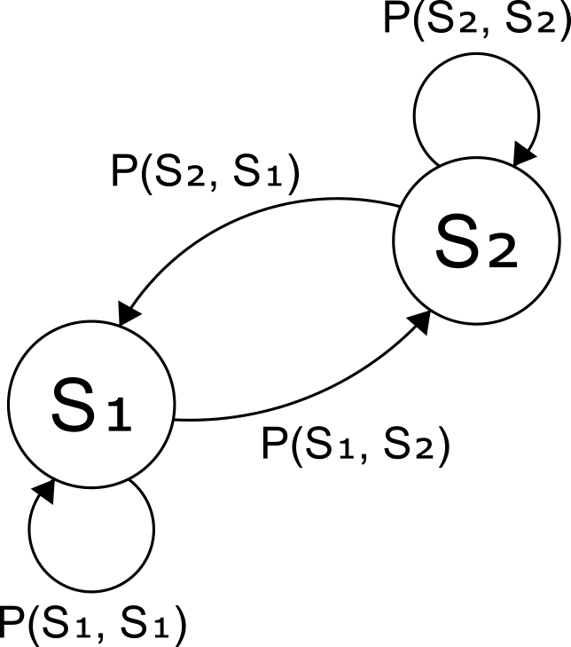{style="max-height: 300px; display: block; margin: auto"}

# Today

:::nonincremental
1. **King Markov analogy for MCMC**
2. The Metropolis algorithm 
3. Hamiltonian Monte Carlo & No-U-Turn Sampler
:::

# Meet King Markov and his very realistic setup

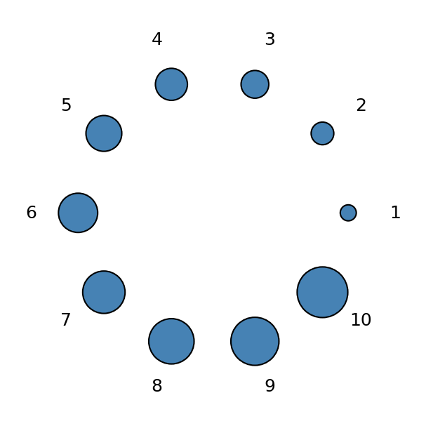{style="max-height: 300px"}

- Owns 10 islands arranged in a ring
- Island $i$ is $i$ times bigger than island 1
- Can only compare **two adjacent islands** at a time
  - "Is the next island bigger or smaller than this one, and by how much?"
  - Never "how big is island 7 in absolute terms?"
- Must visit each island in proportion to its size

# The Metropolis algorithm
- Proposal: flips a coin to propose clockwise or counter-clockwise

:::fragment
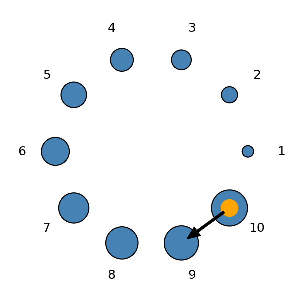{style="max-height: 450px"}
:::

# Proposal step
- Intuition: **King Markov wants to spend more time on the island that is bigger**
- Compare relative sizes: $\frac{\text{size}_{\text{proposal}}}{\text{size}_{\text{current}}}$
  - If proposal is **bigger** → always move
  - If proposal is **smaller** → move proportional to relative sizes
  - If rejected, **stay on current island** for one more week
  - In practice, this is moving with probability $\min(1, \frac{\text{size}_{\text{proposal}}}{\text{size}_{\text{current}}})$

# Island chain — week 0
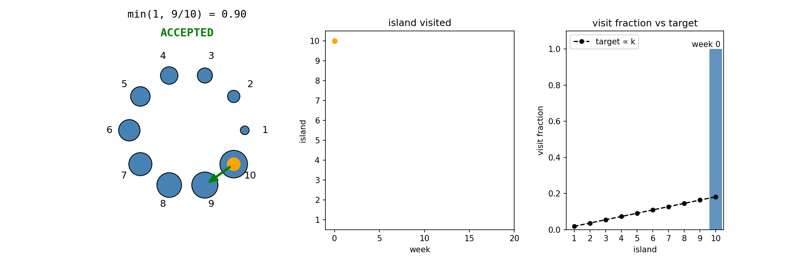

# Island chain — week 1

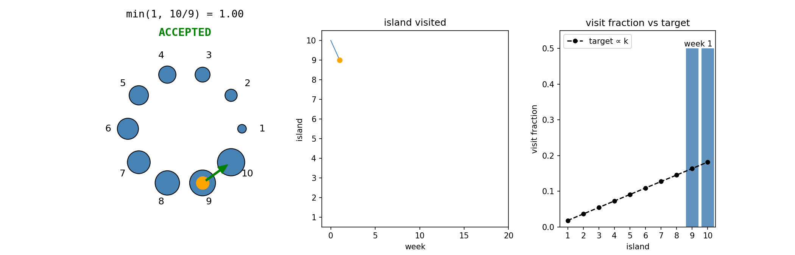

# Island chain — week 2

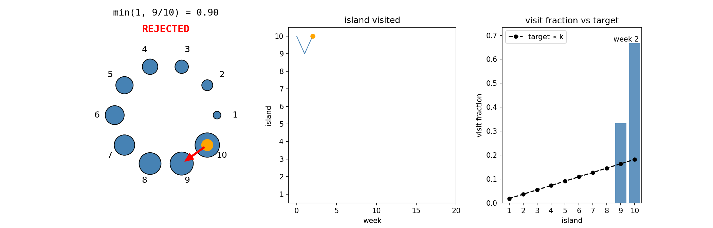

# Live chain — island

<video src="out/01_island.mp4" controls style="max-height: 560px"></video>

# Convergence — island

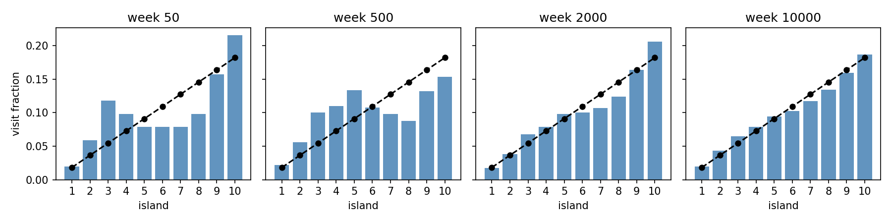
- Acceptance rate: 83.40%

# What just happened

- We never told the king to visit in those proportions
- We only gave him a rule for comparing two adjacent islands
- **The proportions emerged.** That's the whole trick of MCMC.
- This is an example of the **Metropolis algorithm**: guarantees that it converges to the correct proportion in the long run, as long as proposals are symmetric

# Today

:::nonincremental
1. King Markov analogy for MCMC
2. **The Metropolis algorithm**
3. Hamiltonian Monte Carlo & No-U-Turn Sampler
:::

# From islands to parameter values

| Analogy | MCMC |
|---|---|
| Islands | Parameter values |
| Island sizes | Posterior probabilities |
| Weeks on an island | Samples from the posterior |

Let's see this work in a simple regression setup

# Simulated data
- True model: $y \sim \text{Normal}(\mu, \sigma)$, $\quad \mu = \alpha + \beta x$
- True values: $\alpha = 0$, $\beta = 0.6$, $\sigma = 0.25$

:::fragment
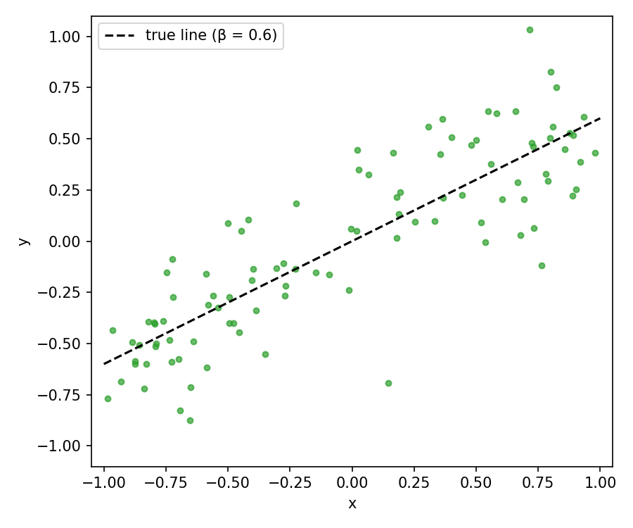{style="max-height: 400px"}
:::

# Model
- $y \sim \text{Normal}(\mu, \sigma)$, $\quad \mu = \alpha + \beta x$
- Assume we know $\alpha = 0$ and $\sigma = 0.25$, and we only estimating $\beta$
- Flat prior over 10 candidate $\beta$s: $\{0.40, 0.45, \ldots, 0.85\}$

:::fragment
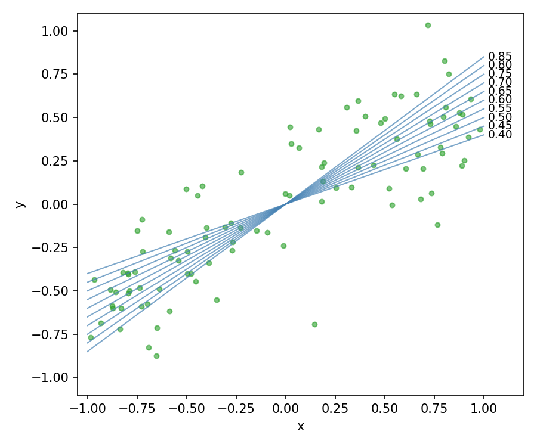{style="max-height: 360px; display: block; margin: auto"}
:::

- So we want to sample from the posterior: $P(\beta = i | \text{Data})$ for $i \in \{0.40, 0.45, \ldots, 0.85\}$
- Yes, discrete $\beta$s are ridiculous, but we are mapping directly to the islands. We'll relax this shortly

# Acceptance probability

- Remember King Markov only knew the **relative** sizes of islands ($\frac{\text{size}_{\text{proposal}}}{\text{size}_{\text{current}}}$)
- Similarly, only the **relative** posterior matters here
- The acceptance probability is:
  - $\min\!\left(1, \dfrac{P(\beta_{proposed} | \text{Data})}{P(\beta_{current} | \text{Data})}\right)$

# Why we don't need P(Data)
- $\dfrac{P(\beta_{proposed} | \text{Data})}{P(\beta_{current} | \text{Data})} = \dfrac{\dfrac{P(\text{Data} | \beta_{proposed})\,P(\beta_{proposed})}{P(\text{Data})}}{\dfrac{P(\text{Data} | \beta_{current})\,P(\beta_{current})}{P(\text{Data})}} = \dfrac{P(\text{Data} | \beta_{proposed})\,P(\beta_{proposed})}{P(\text{Data} | \beta_{current})\,P(\beta_{current})}$
- the normalizing constant $P(\text{Data})$ cancels — we only need the **likelihood** and the **prior**

# Discrete regression — step 0

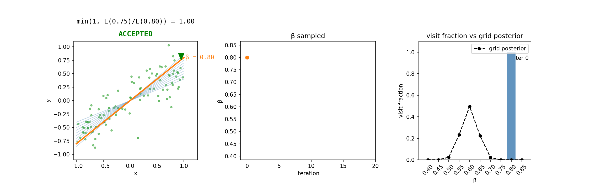

# Discrete regression — step 1

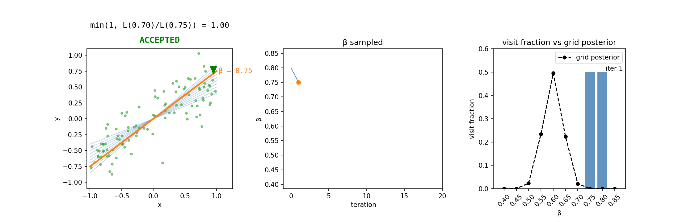

# Discrete regression — step 2

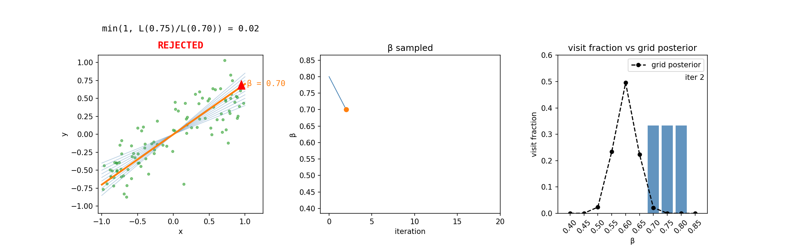

# Live chain — discrete regression

<video src="out/02_regression_discrete.mp4" controls style="max-height: 560px"></video>

# Convergence — discrete regression

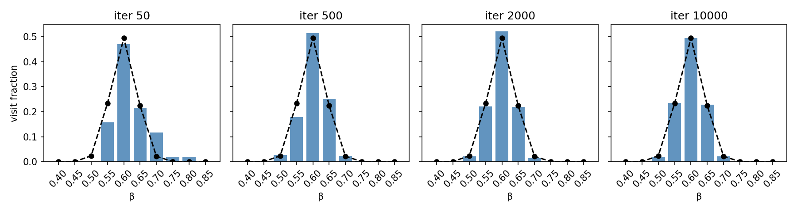
- Acceptance rate: 50.73%

# From discrete steps to random jumps
- To sample from a continuous space, we need to make proposals using a random distribution, rather than one step left/right
- Use $\beta_{proposed} \sim \text{Normal}(\beta_{current}, 0.1)$: Note that this is **symmetric** (needed to make Metropolis work)
- Note that 0.1 is a hyperparameter that needs to be tuned

# Continuous 1-param — step 0

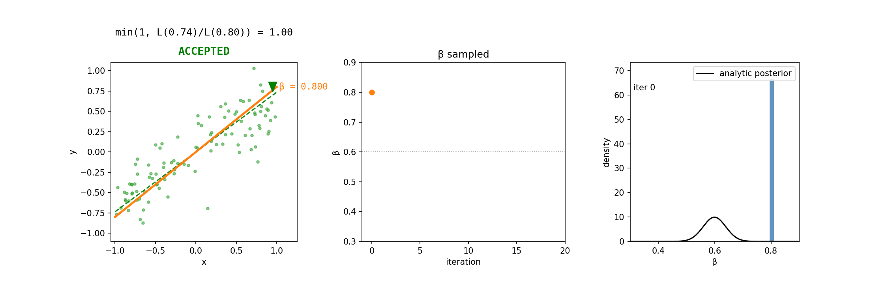

# Continuous 1-param — step 1

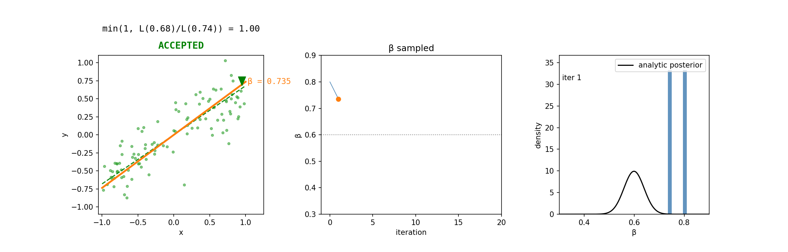

# Live chain — continuous 1-param

<video src="out/03_regression_continuous.mp4" controls style="max-height: 560px"></video>

# Convergence — continuous 1-param

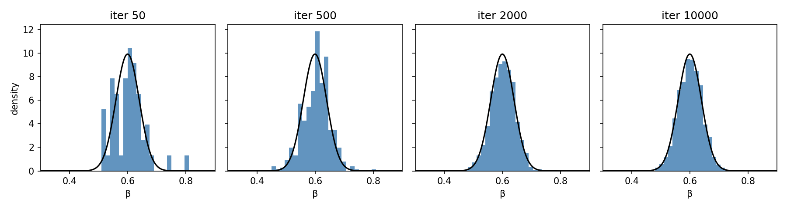
- Acceptance rate: 43.66%

# Now let's do 2 parameters
- $y \sim \text{Normal}(\mu, \sigma)$, $\quad \mu = \alpha + \beta x$
- Assume we now only know $\sigma = 0.25$, and we are sampling $(\alpha, \beta)$ jointly
- Procedure is identical: propose, compare ratios, accept or stay
- Proposal: independent Gaussians
  - $\alpha_{proposed} \sim \text{Normal}(\alpha_{current}, 0.05)$
  - $\beta_{proposed} \sim \text{Normal}(\beta_{current}, 0.10)$
- Still symmetric → same acceptance formula
- But now **two step sizes** to tune — same headache, multiplied

# Two-param regression — step 0

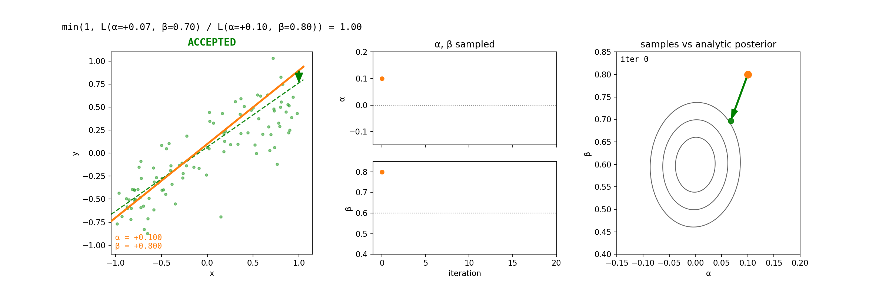

# Two-param regression — step 1

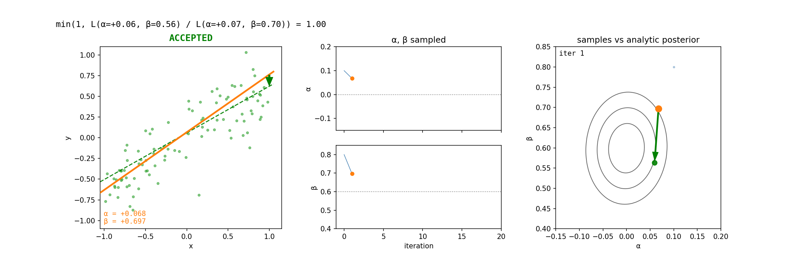

# Live chain — two-param regression

<video src="out/04_regression_2param.mp4" controls style="max-height: 560px"></video>

# 2D convergence — two-param regression

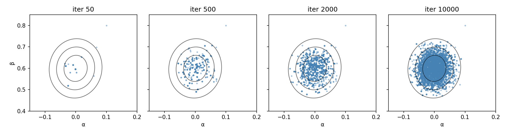
- Acceptance rate: 25.13%

# 1D marginals — two-param regression

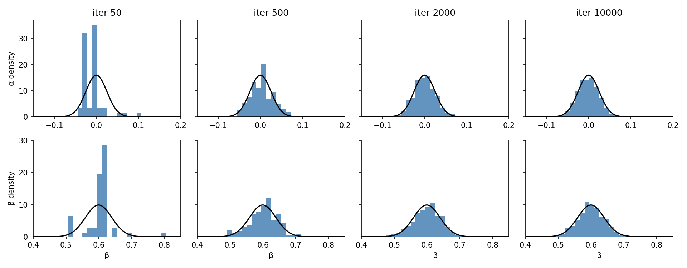

# 2-param takeaway

- Chain still converges to the right posterior
- But tuning gets painful: two step sizes, both interacting with posterior geometry
- Hand-tuning will become hopeless if we scale to a model with hundreds of parameters
- Acceptance rate drops fast with dimensions: 43% (1-param regression) → 25% (2-param regression). Imagine 500.
- **This is the gap HMC fills**

# Today

:::nonincremental
1. King Markov analogy for MCMC
2. The Metropolis algorithm 
3. **Hamiltonian Monte Carlo & No-U-Turn Sampler**
:::

# Choosing step size is a mess

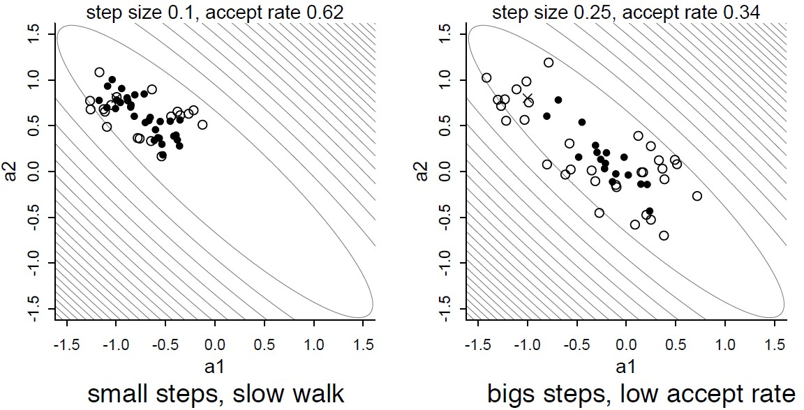{style="max-height: 460px"}

Fundamental tradeoff, especially as dimensions get high

# Guess and check strategies get stuck
- Case 1: **Narrow / highly-curved posteriors** 

<video src="external/metropolis_donut.mp4" controls style="max-height: 480px"></video>
<small>demo from <a href="https://chi-feng.github.io/mcmc-demo">chi-feng.github.io/mcmc-demo</a></small>

# Guess and check strategies get stuck
- Case 2: **Multi-modal posteriors** 

<video src="external/metropolis_multimodal.mp4" controls style="max-height: 480px"></video>
<small>demo from <a href="https://chi-feng.github.io/mcmc-demo">chi-feng.github.io/mcmc-demo</a></small>

# Concentration of measure

- In high-D, typical values are **far from the mode**
- For a $d$-dim Normal, mass sits on a thin shell at radius $\sim \sqrt{d}$ from the mode

:::fragment
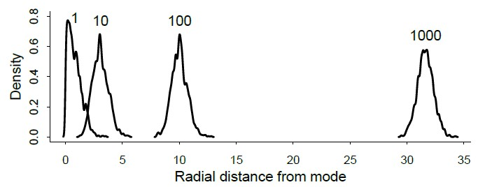{style="max-height: 360px"}
:::

- Random-walk proposer centered on the current point keeps suggesting moves into the low-density interior
- Most proposals miss the typical set and get rejected

# What we need

- We need something that is smarter than blind local random walks
- Smarter proposals: proposals stay in high-density regions instead of wandering blindly

# Enter King Monty

- Monty's kingdom is a narrow N–S valley
- The valleys are densely populated; the ridges are empty
- King Monty also wants to visit constituents in proportion to where they live
- Location = parameter values; population density = posterior probability

# Intuition

- Imagine flicking a metal ball sitting in a bowl (giving it some **momentum**)
- No friction — but we can magically stop it after some **pre-specified** duration
- Wherever it stops is the sample

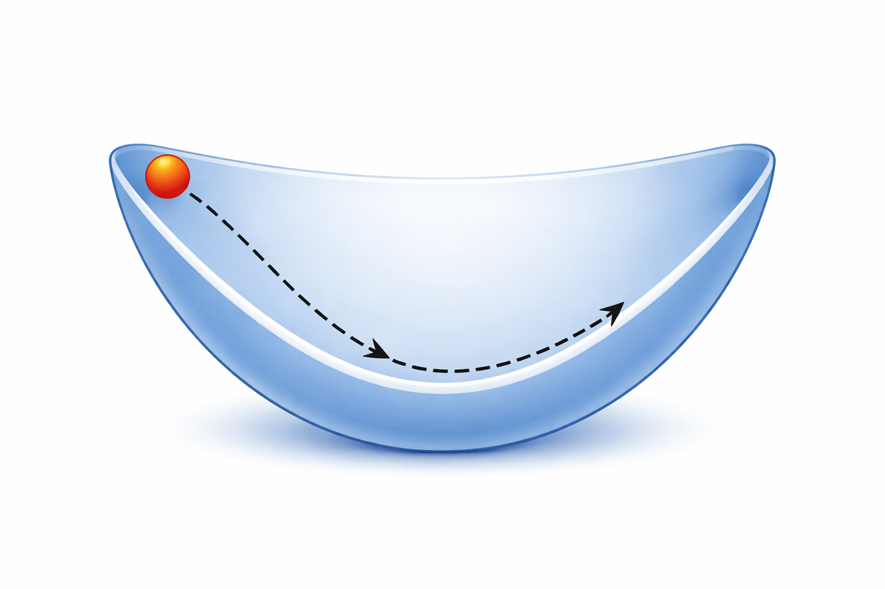{style="max-height: 350px"}
<small>image generated by ChatGPT</small>

# King Monty's algorithm

1. Pick a **random direction** (N or S) and a **random momentum**
2. Drive. The car obeys physics:
   - Speeds up going downhill (toward high population)
   - Slows going uphill (toward low population)
3. Drive for a **pre-specified duration**, then stop
4. Wherever you are is the sample
5. Repeat

# King Monty IS HMC

| Analogy | HMC |
|---|---|
| Valley landscape | Posterior distribution |
| Car's position | Parameter values |
| Population density | Posterior probability |
| Random kick | Random momentum draw |
| Car's physics | Hamiltonian dynamics |
| Pre-specified drive time | leapfrog steps × step size |

# Momentum and energy

- Kinetic energy (from the random momentum) + potential energy ($-\log$ posterior); together: the **Hamiltonian**
- The total energy (Hamiltonian) is (approximately) conserved along the trajectory
- Energy from the kick bounds how high the car can climb
  - Small kick → stays near valley bottom → samples near the mode
  - Big kick → climbs the walls → samples in the tails
  - The random momentum draw is what gives HMC tail coverage

# Pre-specified duration

- Number of **leapfrog steps** ($L$) and **step size** ($\varepsilon$)
- Each leapfrog step:
  1. Check the **gradient** at the current position — which way is downhill, how steep
  2. Use it to update the car's **speed**
  3. Use the new speed to update the car's **position**
- Repeat $L$ times with step size $\varepsilon$. Wherever the car ends up is the proposal.

# Accepting the proposal
- Now the acceptance is based on whether the total energy is conserved
- Real physics: energy is conserved exactly → you'd accept every proposal
- Leapfrog is a discrete approximation → energy drifts slightly
- The MH step accepts with a probability based on how much "energy" leaked

# One full trajectory — HMC

<video src="out/05_hmc_walkthrough.mp4" controls style="max-height: 560px"></video>

# Multiple proposals in a row — HMC

<video src="out/05_hmc_chain.mp4" controls style="max-height: 560px"></video>

# Convergence — HMC

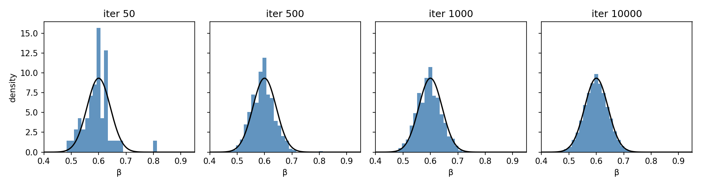
- Acceptance rate: 99.98%

# HMC — narrow / highly-curved posteriors

<video src="external/hamiltonian_donut.mp4" controls style="max-height: 480px"></video>
<small>demo from <a href="https://chi-feng.github.io/mcmc-demo">chi-feng.github.io/mcmc-demo</a></small>

# HMC — multi-modal posteriors

<video src="external/hamiltonian_multimodal.mp4" controls style="max-height: 480px"></video>
<small>demo from <a href="https://chi-feng.github.io/mcmc-demo">chi-feng.github.io/mcmc-demo</a></small>

# Why HMC works better

- Trajectories move the proposal **far** in one iteration
- …while staying in high-density regions (follows the gradient)
- Doesn't get stuck (at least for this reason)!
- Extra variables (momentum, energy) provide diagnostics (e.g., when energy isn't conserved)

# Costs
- Several gradient evaluations per iteration (more expensive)
- Almost always worth it — much better samples per iteration

# Tuning HMC — two knobs

- Number of **leapfrog steps** ($L$) and **step size** ($\varepsilon$)
- Can cause the U-turn problem and gets stuck again if chosen poorly

<video src="external/hamiltonian_standard_uturn.mp4" controls style="max-height: 480px"></video>
<small>demo from <a href="https://chi-feng.github.io/mcmc-demo">chi-feng.github.io/mcmc-demo</a></small>

- Still two knobs! Can we do better?

# NUTS — No-U-Turn Sampler

- Picks number of leapfrog steps **adaptively** — keep driving until the trajectory folds back on itself, then stop
  - No more guessing "how long is long enough"
- Picks step size **adaptively during warmup**
  - Before the actual sampling, draw some samples to pick step size
  - Samples during warmup are NOT from the posterior, and are automatically discarded
- Only one knob now, essentially: **target acceptance rate**
  - The warmup gets chosen based on this
  - Usually some default exists
  - Higher target acceptance rate → smaller step size → fewer divergences, but more leapfrog steps per sample (slower)
- You will be using this for the rest of the quarter

# Thanks!

Questions?
